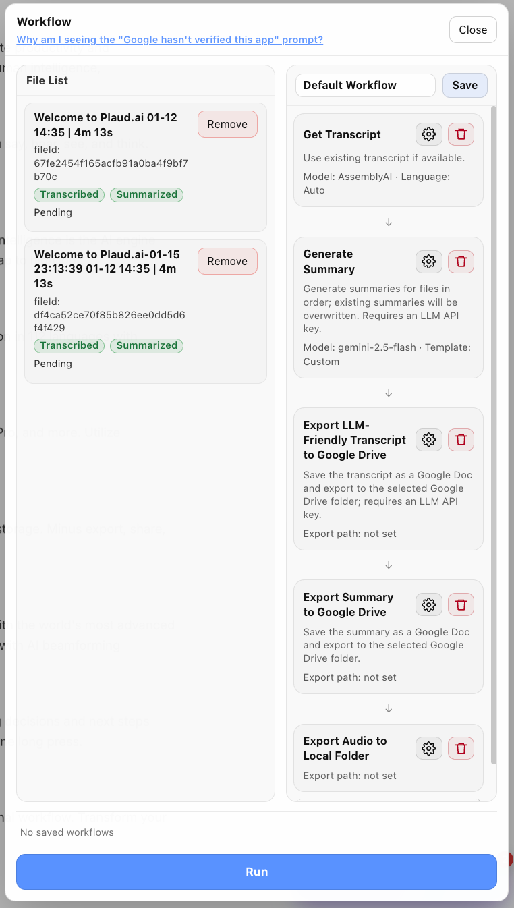

# AudioBridge Browser Extension

**AudioBridge** is a lightweight, local-first browser extension that turns your audio recordings into **LLM-ready knowledge**, using **your own OpenAI-compatible APIs**, and connects the results **anywhere you want**.

> **One-line summary:**  
> **AudioBridge connects your audio data to anywhere.**

It is built for users who want **full control, transparency, extensibility, and lower cost**, without relying on bundled transcription services or closed backends.

---

## ✨ What AudioBridge Can Do

### 🎧 Multi-file Audio Processing
- Process **multiple audio files at once**
- Add files via **drag & drop** or **right-click menu**
- Clear per-file status for transcription and summarization

---

### 🔁 Configurable Workflows
Build your own pipeline, step by step:

- Transcription  
- Summarization  
- Export (LLM-friendly formats)  
- Upload to **Google Drive**

All steps can be executed in a single flow.

Once completed, your audio data can be directly connected to **NotebookLM**, **Gemini**, or any other LLM you already use.

---

### 🤖 LLM-Friendly by Design
- Clean, structured transcripts
- Optimized for long-context models
- Designed for reasoning, Q&A, and downstream summaries
- Works with **OpenAI-compatible APIs** and **Gemini**

Your audio stops being “dead files” and becomes part of your personal knowledge base.

---

### 🧩 Extensible System
AudioBridge is a **workflow system**, not a single-purpose tool.

New steps and integrations can be added over time — like building your workflow with LEGO blocks.

---

### 🔒 Local-First & Server-Free
- No AudioBridge backend
- No account system
- No subscription
- No forced service dependency

Even if development stops one day, existing functionality will continue to work.

---

## 🚀 Primary Distribution: GitHub Releases (Recommended)

Due to **slow and unpredictable review cycles** in browser extension stores, **GitHub Releases** are the **primary and most up-to-date distribution channel**.

👉 **Please download AudioBridge from the GitHub Releases page**  
(Cloning the repository is unnecessary.)

**Why GitHub Releases?**
- Verified, ready-to-install builds
- Always includes the latest features and bug fixes
- No build steps required

> ⚠️ This repository mainly contains documentation and usage instructions.  
> It does **not** include the full extension source code.

---

## 📦 Installation (Chrome / Edge)

### Step 1: Download
1. Open the **Releases** page
2. Download the latest **unpacked extension ZIP**
3. Unzip it to a local folder

---

### Step 2: Install via Developer Mode

#### Chrome
1. Open `chrome://extensions`
2. Enable **Developer mode**
3. Click **Load unpacked**
4. Select the unzipped AudioBridge folder

#### Microsoft Edge
1. Open `edge://extensions`
2. Enable **Developer mode**
3. Click **Load unpacked**
4. Select the unzipped AudioBridge folder

⚠️ Manual installations do not support automatic updates.  
Please check GitHub Releases periodically.

---

## 🔧 How It Works

1. Log in to your **PLAUD Web** account
2. Open a page with your audio recordings
3. Click the **AudioBridge** extension icon
4. Configure your **OpenAI-compatible / Gemini API key**
5. Select one or multiple audio files
6. Run transcription, summarization, export, or upload workflows
7. Use the results in PLAUD, Google Drive, NotebookLM, or other LLM tools

AudioBridge never stores your audio or transcripts on its own servers.

---

## 🖼 Screenshots

---

## 🔐 Privacy & Data Usage

- No built-in transcription service
- No subscriptions
- No user tracking
- API keys are stored locally in your browser
- All requests are explicitly user-initiated

You remain fully responsible for third-party API usage and compliance.

---

## ⚠️ Disclaimer

AudioBridge is an **independent open project**.

It is **not affiliated with, endorsed by, or officially connected to PLAUD**, Google, OpenAI, or any hardware or service provider.

All trademarks belong to their respective owners.

---

## 💬 Feedback & Roadmap

Feedback directly shapes AudioBridge’s future.

- **GitHub Issues** — bug reports & feature requests  
- **GitHub Discussions** — workflow ideas & design feedback  

If you have a workflow in mind, feel free to share it.

---

## ⭐ Support the Project

AudioBridge is a side project built in spare time.  
No monetization. No donations.

If it saves you time or friction, a ⭐ on GitHub is more than enough.

Thank you for using AudioBridge 🙌
